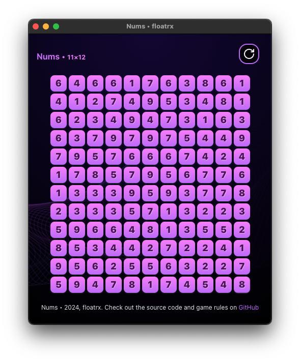

# Electron webview

This is a simple example of how to wraps any web page in an Electron webview as native desktop application.

In this example, we use [Electron](https://www.electronjs.org/) to create a desktop application that wraps [https://nums.floatrx.net](https://nums.floatrx.net) in a webview.




### Install dependencies
```bash
bun install
```

### Update the webview URL (optional)
Edit the index.js
```js
await mainWindow.loadURL('https://your-app.com')
```

### Test the app (run)
```bash
bun start
```

### Pack (build) the app into desktop application
```bash
bun packager
```

All the best! 🚀
